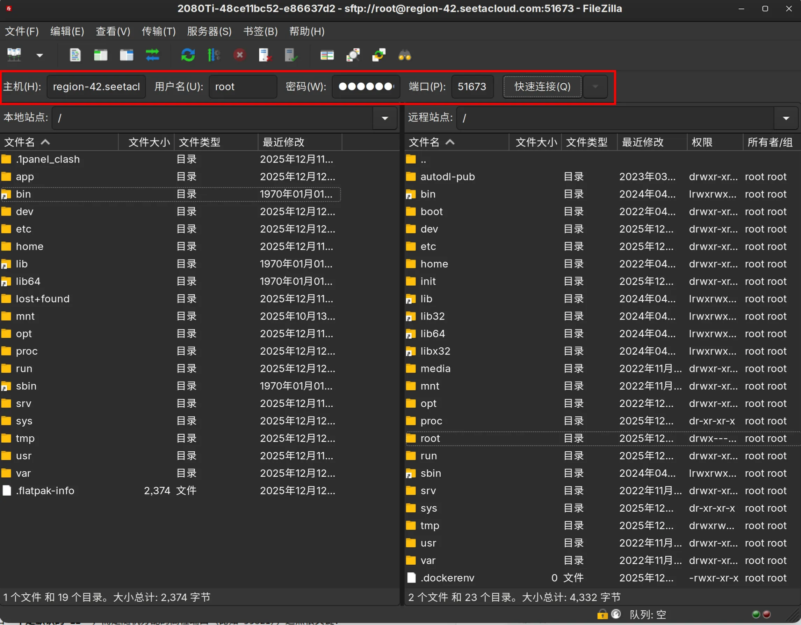
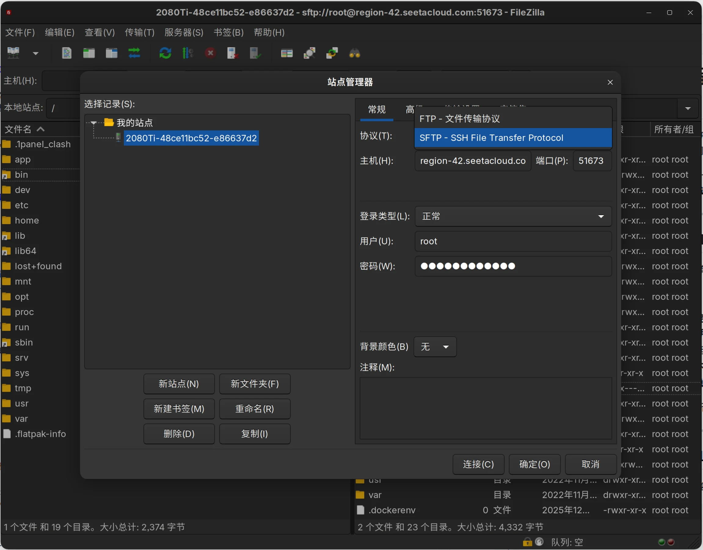

# 用 FileZilla 连上你的远程服务器：SFTP 快速上手指南

你是不是也经常遇到这种情况：刚在 AutoDL 上开了一台 GPU 机器，写好了训练脚本，却卡在“怎么把本地的数据传上去”？或者想下载模型结果，但网页上传下载又慢又不稳定？

别折腾 `scp` 命令了（虽然它很好用），今天聊聊一个更直观、更省心的图形化工具 —— **FileZilla**。重点不是装软件，而是**怎么连、用什么协议、为什么选 SFTP**，以及**如何快速和 AutoDL 打通**。

---

> **这里需要提一嘴**
> 
> [`FlieZilla`](https://filezilla-project.org/) 实际上基本已经停止维护了
> 
> 如果是在 `Windows` 下使用的话，现在更推荐使用 [`WinSCP`](https://winscp.net/) ，操作上大体一致。


## 💡快速连接（如果懒得看后面内容的话）

> 例如：
> 
> 登陆命令：ssh -p 51673 root@region-42.seetacloud.com
> 密码：**********

则拆解后分别填入几个空中，然后点击快速连接即可。




## 一、先搞清楚：FTP、FTPS、SFTP 到底有什么区别？

很多人一打开 FileZilla 就懵了：协议下拉菜单里有三个选项，该选哪个？

简单说：

- **FTP**：最老的文件传输协议，速度快但**不加密**。账号密码、文件内容都是明文传输，相当于在大街上喊“我的密码是123456”，**绝对不要在公网用**。
- **FTPS**：FTP + SSL/TLS 加密，安全性提升，但配置复杂，兼容性一般，现在用得越来越少。
- **SFTP**：全称是 *SSH File Transfer Protocol*，**不是 FTP 的变种**！它跑在 SSH 协议之上，只要能 `ssh` 登录的服务器，基本都能用 SFTP。**加密、稳定、通用**——这就是我们推荐的选择。

所以，除非你明确知道自己在用传统 FTP 服务，否则一律选 **SFTP**。

---

## 二、实战：用 SFTP 连接 AutoDL 服务器

假设你已经在 [AutoDL](https://www.autodl.com/) 创建了一台实例，控制台会显示类似这样的连接信息：

```
IP 地址（或者域名）：47.98.xxx.xxx
端口：35621
用户名：root
密码：******
```

注意：AutoDL 的 SSH 端口**不是默认的 22**，而是随机分配的高位端口（比如 35621），这点很关键！




### 步骤 1：打开 FileZilla 的「站点管理器」

点击顶部菜单 **文件 → 站点管理器**（或按 Ctrl+S）。

### 步骤 2：新建一个站点

- 左下角点「新站点」，起个名字，比如 `AutoDL - 训练机01`
- 右侧填写连接参数：
  - **协议**：选择 `SFTP - SSH File Transfer Protocol`
  - **主机**：填 AutoDL 给你的 IP，如 `47.98.xxx.xxx`
  - **端口**：填它给的端口号，比如 `35621`（**别漏了！**）
  - **登录类型**：选 `正常`
  - **用户**：通常是 `root`
  - **密码**：粘贴 AutoDL 提供的密码

> ⚠️ 第一次连接时，会弹出一个安全警告：“未知的 SSH 主机密钥”。这是正常的，点「确定」信任即可。以后再连就不会问了。

### 步骤 3：开始传文件！

连上之后，界面左右分栏：

- **左边**是你本地电脑的文件
- **右边**是 AutoDL 服务器的目录（默认在 `/root`）

想上传数据集？直接把本地文件夹拖到右边就行。  
想下载训练好的模型？右键远程文件 → “下载”。

速度通常比网页上传快好几倍，而且断点续传、多线程队列都支持，稳得很。

---

## 三、小技巧 & 注意事项

- **路径别搞错**：AutoDL 的工作目录一般是 `/root`，但你的代码可能放在 `/root/autodl-tmp`，注意切换。
- **中文文件名乱码？** 在「站点管理器 → 字符集」里选“强制 UTF-8”，基本能解决。
- **连不上？** 先确认：
  - 实例是否正在运行（关机状态无法连接）
  - 端口是否输对（最容易出错的地方！）
  - 防火墙是否放行（AutoDL 默认已开放，不用管）
- **不想每次输密码？** 可以用 SSH 密钥登录（FileZilla 支持），但对新手来说密码够用了。

---

## 四、最后

FileZilla 不是什么高深工具，但它解决了最实际的问题：**让我专注做事，而不是和命令行较劲**。尤其是配合 AutoDL、Vast.ai 这类平台，SFTP 几乎成了日常操作的标配。

下次开新实例，不妨试试这个组合：AutoDL + FileZilla，效率立马提上来。

> 🌟 **参考资料**  
> - [B站演示视频：FileZilla 连 AutoDL 全流程](https://www.bilibili.com/video/BV1WiVUzFEqT)  
> - 官网：[https://filezilla-project.org/](https://filezilla-project.org/)

有问题？欢迎留言交流。  
祝你炼丹顺利，loss 一路下降！
