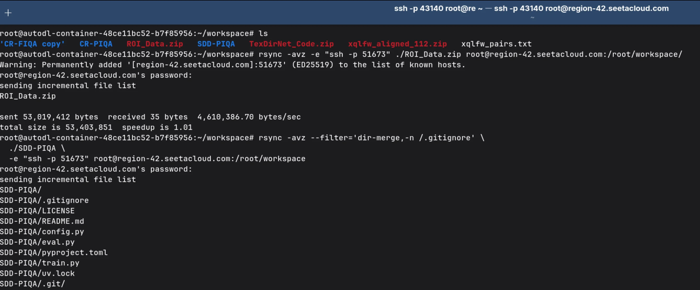

# 用 rsync 在两台服务器之间直接传文件

手上有多台远程服务器，想把一台上的数据快速同步到另一台，但又不想先把文件下载到自己电脑再上传？不仅慢，还占本地带宽和空间。好消息是——**完全没必要这么麻烦**！只要两台服务器都能通过 SSH 访问，我们就可以让它们“直接对话”，用 `rsync` 把文件从 A 传到 B，全程不经过你的电脑。今天就手把手教你怎么做。

---

> 假设有两台服务器：
> 
> - **Server A**：`ssh -p 51673 root@region-42.seetacloud.com`
> - **Server B**：`ssh -p 43140 root@region-42.seetacloud.com`
> 
> 目标：把 Server A 上的 `/data/logs/` 目录同步到 Server B 的 `/backup/logs/`。
> 
> ✅ 注意：这个方法要求 **Server A 能直接连接 Server B 的 SSH 端口（43140）**。大多数云平台或容器环境如果在同一区域，通常是允许的。如果不通，可能需要走本地中转（那是另一个话题了）。

---

## 第一步：登录到源服务器（Server A）

我们从“发送方”出发。先连上 Server A：

```bash
ssh -p 51673 root@region-42.seetacloud.com
```

现在你就在 Server A 上了。

---

## 第二步：用 rsync 推送文件到 Server B

在 Server A 的终端里，运行下面这条命令：

```bash
rsync -avz -e "ssh -p 43140" /data/logs/ root@region-42.seetacloud.com:/backup/logs/
```

这样 `/data/logs/` 就会传送到 `root@region-42.seetacloud.com:/backup/logs/`

<details>
<summary> 这条命令是什么意思？ </summary>

<br>
    
- `rsync`：同步工具，高效、支持断点续传。
- `-a`：归档模式，保留权限、时间、目录结构等。
- `-v`：显示详细过程（可选，方便看进度）。
- `-z`：传输时压缩数据，节省带宽。
- `-e "ssh -p 43140"`：指定用 SSH 连接，并且端口是 43140（也就是 Server B 的端口）。
- `/data/logs/`：本地要同步的目录（注意结尾的 `/` 很重要！）
- `root@region-42.seetacloud.com:/backup/logs/`：目标地址，就是 Server B。

> 📌 小贴士：路径末尾加 `/` 表示“同步这个目录里的内容”；不加 `/` 则会把整个目录本身也复制过去。比如：
> - `/data/logs/` → 内容直接放进 `/backup/logs/`
> - `/data/logs` → 会在 `/backup/logs/` 下再建一个 `logs` 文件夹

</details>


上面的例子是从 Server A **推送**到 Server B。你也可以反过来，在 Server A 上**拉取** Server B 的文件：

```bash
rsync -avz -e "ssh -p 43140" root@region-42.seetacloud.com:/remote/data/ /local/destination/
```

根据你的需求选择就行。

---

## 🚫 让 rsync 忽略不需要的文件（像 Git 一样）

同步时，我们通常不希望把临时文件、日志、缓存等垃圾传过去。好消息是，**rsync 可以像 Git 一样读取忽略规则**。很多项目会在不同子目录放 `.gitignore`，比如：

```
project/
├── .gitignore          # 忽略 *.log
└── src/
    └── logs/
        └── .gitignore  # 忽略所有文件，但保留 .gitignore 本身
```

**怎么办？用 `dir-merge`！**

```bash
rsync -avz --filter='dir-merge,-n /.gitignore' \
  ./project/ \
  -e "ssh -p 43140" root@region-42.seetacloud.com:/root/project/
```

> 💡 小技巧：加 `-n` 参数先预览（dry-run）：
> ```bash
> rsync -avn --filter='dir-merge,-n /.gitignore' ./project/ /tmp/test/
> ```

这几乎是目前最接近“让 rsync 完全模拟 Git 忽略行为”的原生方案，无需额外脚本！


<details>
<summary> 🆚 rsync vs git：相似在哪？不同在哪？ </summary>

<br>    
    
| 特性 | rsync | Git |
|------|-------|-----|
| **核心目的** | 高效同步文件（本地 ↔ 远程，或远程 ↔ 远程） | 版本控制：记录文件变更历史 |
| **是否只传差异？** | ✅ 是！只传变化的字节块（增量传输） | ✅ 是！但基于快照和对象存储 |
| **需要“仓库”吗？** | ❌ 不需要，直接操作任意目录 | ✅ 必须有 `.git` 仓库 |
| **保留历史版本？** | ❌ 默认不保留（除非你手动备份） | ✅ 自动保存完整历史 |
| **命令风格** | `rsync 源 目标`（像 cp 的升级版） | `git add/commit/push`（工作流驱动） |
| **网络协议** | 通常走 SSH 或 rsync daemon | 支持 SSH、HTTPS、Git 协议等 |

---

所以，虽然 `rsync -a source dest` 看起来像 `git push`（都是“同步”），但 rsync 更像是一个**聪明的复制工具**，而 Git 是一个**时间机器**。

> 有趣的是:
> Git 底层其实也借鉴了类似 rsync 的思想（比如 packfile 增量压缩），而 rsync 的高效算法（rolling checksum）也曾启发过很多同步工具。所以它们“神似”是有原因的！

</details>
    
---



## 小结

- `rsync + SSH` 是服务器间传文件的黄金组合。
- 关键在于用 `-e "ssh -p 端口号"` 指定目标服务器的 SSH 端口。
- 配合 SSH 公钥，可以做到全自动、无人值守同步。
- 用 `--filter='dir-merge,-n /.gitignore'`，让 rsync 真正理解多层 `.gitignore`。
- 整个过程**不经过你的本地电脑**，速度快、效率高。

下次再需要在两台服务器之间搬数据，试试这个方法吧！你会发现，原来“让服务器自己干活”这么简单 😊

---

> 💡 提醒：如果你用的是某些容器平台（比如 SeetaCloud、AutoDL 等），请确认容器之间是否允许网络互通。如果 `telnet region-42.seetacloud.com 43140` 不通，那可能得走本地中转了。但在大多数标准云服务器上，这个方法都能跑得很顺畅。
