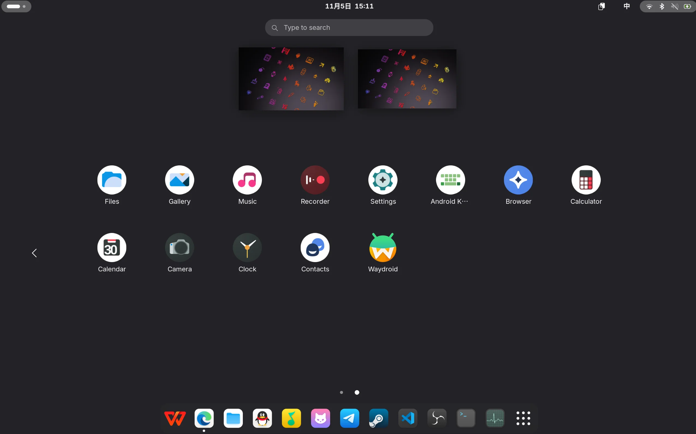
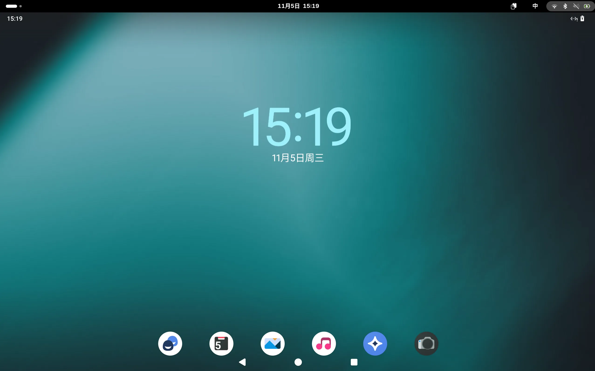
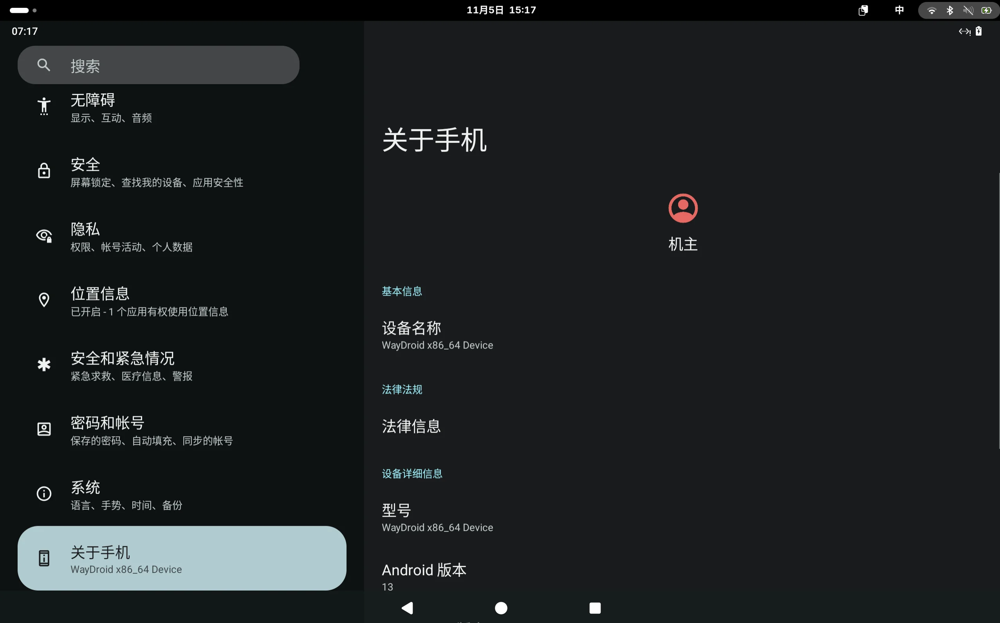

> 参考：[https://wiki.archlinuxcn.org/zh-cn/Waydroid](https://wiki.archlinuxcn.org/zh-cn/Waydroid)

#   
1\. Waydroid 安装  

由于 `archlinuxcn` 源中已收录 `waydroid-image` 软件包，直接使用 paru -S waydroid-image 进行安装。

（会安装 waydroid 软件包和镜像）

# 2\. 初始化

## 2.1 然后进行初始化：

    sudo waydroid init
    

## 2.2 初始化支持 GApps 的 Waydroid：

    sudo waydroid init -s GAPPS
    

## 2.3 接下来启动 `waydroid-container.service`。

    sudo systemctl enable --now waydroid-container
    

Waydroid 现在应该能正常工作了。  

# **3\. 安装原生库支持（libndk / libhoudini）**

为了让 Waydroid 中的 Android 应用能够更好地兼容 x86\_64 架构（尤其是运行仅提供 ARM 架构的 APK），我们需要安装相应的二进制转译层。根据你的 CPU 架构，选择以下方案之一：

-   **Intel 或 AMD 处理器**：推荐使用 `libndk`（基于 Google 的 Native Development Kit 转译方案，兼容性更好）。
    
-   **仅 Intel 处理器（旧方案）**：可选用 `libhoudini`（由 Intel 开发，现已逐渐被 libndk 取代）。
    

## **3.1 使用 waydroid-helper（图形化工具）**

如果你偏好图形界面操作，可以安装 `waydroid-helper`：

[waydroid-helper/waydroid-helper](https://github.com/waydroid-helper/waydroid-helper)


#### **3.2 使用 waydroid\_script（命令行脚本）**

若你更喜欢命令行方式，可使用社区维护的自动化脚本 `waydroid_script`：

```shellscript
git clone https://github.com/casualsnek/waydroid_script
cd waydroid_script
python3 -m venv venv
venv/bin/pip install -r requirements.txt

# 安装 libndk 翻译库
sudo venv/bin/python3 main.py install libndk
复制
# 安装 libhoudini 翻译库
sudo venv/bin/python3 main.py install libhoudini
```

脚本会自动下载对应架构的转译库、挂载到容器内，并重启 Waydroid 服务以生效。

#### **3.3 验证安装**

安装完成后，可在 Waydroid 中打开一个仅支持 ARM 的应用（如某些国产 App 或游戏），观察是否能正常启动。你也可以通过以下命令检查容器内是否已加载转译库：

    waydroid log | grep -i "houdini\|ndk"

若看到类似 `Loading /system/lib64/libndk_translation.so` 的日志，则说明配置成功。

* * *

> 💡 **小贴士**：libndk 是目前社区主推的方案，兼容性和性能优于 libhoudini，建议优先使用。即使你是 Intel CPU，也推荐安装 libndk。

* * *

这样，Waydroid 就具备了运行绝大多数 Android 应用的能力，包括那些仅提供 ARM 版本的应用。接下来你可以自由安装 APK、登录账号、甚至使用微信、支付宝等日常软件！

# 4\. 展示界面

## 4.1 Linux 中的新增软件



  

## 4.2 Waydroid 界面



## 4.3 Waydroid 本机信息


