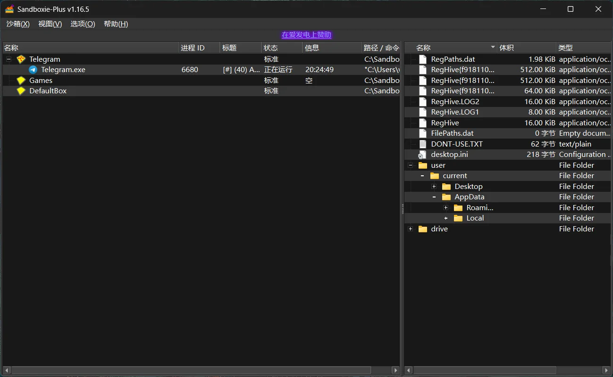

---

# Windows 下的沙盒化方案：像 Flatpak 一样干净运行游戏与应用

> **摘要**：Linux 用户熟悉 Flatpak——它让应用在隔离环境中运行，卸载后不留痕迹。Windows 虽无原生 Flatpak，但通过合理组合系统功能与第三方工具，我们同样能实现“干净安装、彻底卸载、无系统污染”的沙盒体验。本文将为你详解适用于游戏玩家、模拟器用户和普通用户的多种 Windows 沙盒化方案，并提供实操指南。

---

## 一、为什么需要沙盒？

你是否遇到过这些问题？

- 安装一个游戏后，`%AppData%` 和注册表被塞满垃圾文件；
- 卸载模拟器后，发现仍有隐藏配置残留；
- 想试玩一个来路不明的小游戏，又怕中病毒或破坏系统；
- 希望多个版本的软件（如不同 Python 环境、Dolphin 模拟器）互不干扰。

这些问题，**沙盒（Sandboxing）** 正是解药。

> **沙盒的核心目标**：  
> 让程序在一个“隔离环境”中运行，所有文件写入、注册表修改、网络行为都被限制或重定向，删除沙盒即彻底清除一切痕迹。

---

## 二、Windows 原生沙盒能力

### 1. Windows Sandbox（临时沙盒）

- **适用场景**：临时测试软件、试玩游戏
- **特点**：
  - 轻量级虚拟桌面（基于 Hyper-V）
  - 关闭即销毁，100% 无残留
- **局限**：
  - 不支持持久化（无法保存游戏进度）
  - 需 Windows 10/11 Pro 或企业版
  - 启动较慢，不适合日常使用

✅ **推荐用于**：下载了一个可疑的 `.exe` 想试试？丢进 Windows Sandbox！

---

### 2. MSIX + AppContainer（开发者向）

微软推出的现代应用打包格式，配合 UWP 的 **AppContainer** 技术，可实现类似 Flatpak 的权限控制与文件隔离。

- 支持文件/注册表虚拟化
- 可声明网络、设备访问权限
- 卸载干净，无残留

但对普通用户门槛较高，且多数传统 Win32 游戏不兼容。

🛠️ **适合**：企业分发内部工具，或开发者打包可信应用。

---

## 三、最佳实践：Sandboxie-Plus —— Windows 的 “Flatpak 替代品”

对于绝大多数用户（尤其是游戏玩家），**[Sandboxie-Plus](https://sandboxie-plus.com/)** 是目前最接近 Flatpak 体验的解决方案。

### ✅ 为什么推荐它？

| 特性 | 说明 |
|------|------|
| **开源免费** | 社区维护，持续更新 |
| **轻量高效** | 无需虚拟机，资源占用低 |
| **强兼容性** | 支持 DirectX 12 / Vulkan / OpenGL，手柄、音频正常工作 |
| **彻底隔离** | 所有 `%AppData%`、注册表写入均重定向至沙盒目录 |
| **一键清理** | 删除沙盒 = 彻底清除所有痕迹 |

---

### 🔧 如何为游戏创建一个完美沙盒？

#### 步骤 1：下载并安装 Sandboxie-Plus

官网：[https://sandboxie-plus.com/](https://sandboxie-plus.com/)

#### 步骤 2：新建沙箱 → 选择 **“标准沙箱”（黄色图标）**

> ⚠️ 不要选“安全强化”或“Web 浏览器”模板——它们限制太多，可能导致游戏崩溃。

#### 步骤 3：配置关键选项

- **沙箱名称**：如 `Games` 或 `Emulators`
- **恢复路径（Recovery）**：添加你的游戏库目录（如 `D:\ROMs\`），允许沙盒内程序读取真实文件
- **关闭“删除内容”**：除非你只想临时试玩
- **保留默认虚拟化方案（方案2）**：兼容性更好，性能更优

#### 步骤 4：运行游戏

- 右键沙箱 → “Run Program”
- 或直接将 `.exe` 拖入沙箱图标

> 所有存档、配置都会保存在：  
> `C:\Sandbox\<用户名>\<沙箱名>\`

#### 步骤 5：彻底清理

- 右键沙箱 → “Delete Contents”  
- 或直接删除整个沙箱文件夹

✅ **零注册表残留、零 AppData 污染、零心理负担！**

---

### 🎮 实测兼容性（截至 2025 年）

| 软件类型 | 兼容性 | 备注 |
|--------|--------|------|
| Telegram | ✅ 完美 | 注意文件下载位置也在沙盒内 |
| RetroArch / Dolphin / PCSX2 / Yuzu | ✅ 完美 | 建议启用便携模式（如放 `portable.txt`） |
| Steam 单机游戏 | ✅ 良好 | 在线多人游戏可能因反作弊拒绝运行 |
| Unity / Godot 独立游戏 | ✅ 极佳 | 多数支持便携运行 |
| 含内核反作弊的游戏（如 Valorant） | ❌ 不兼容 | 反作弊驱动会检测沙盒环境 |

---

## 四、其他辅助方案

### 1. 便携化（Portable Mode）

许多模拟器（如 Dolphin、RetroArch）支持 **便携模式**：

- 在程序目录放置空文件 `portable.txt`
- 所有配置自动保存在本地，不写入 `%AppData%`

💡 **配合 Sandboxie 使用效果更佳**：双重保险！

---

### 2. 使用 Process Monitor 验证隔离效果

微软官方工具 [Process Monitor](https://learn.microsoft.com/en-us/sysinternals/downloads/procmon) 可实时监控：

- 是否有文件写入真实系统目录？
- 是否有注册表修改泄露？

确保你的沙盒真正“干净”。

---

## 五、总结：如何选择？

| 需求 | 推荐方案 |
|------|----------|
| **长期运行游戏/模拟器，希望干净隔离** | ✅ **Sandboxie-Plus + 标准沙箱** |
| **临时试玩，用完即走** | ✅ **Windows Sandbox** |
| **分发企业应用** | ✅ **MSIX + AppContainer** |
| **追求极致便携** | ✅ **便携模式 + 本地文件夹运行** |

---

## 六、结语

虽然 Windows 没有原生的 Flatpak，但借助 **Sandboxie-Plus** 这样的强大工具，我们完全可以构建出**安全、干净、高性能**的应用运行环境。无论是怀旧模拟器、独立游戏，还是日常软件测试，沙盒都能让你告别“系统越用越卡”的烦恼。

> **干净的系统，从一次正确的沙盒开始。**

---

### 🔗 相关资源

- Sandboxie-Plus 官网：[https://sandboxie-plus.com/](https://sandboxie-plus.com/)
- Process Monitor（微软）：[https://learn.microsoft.com/en-us/sysinternals/downloads/procmon](https://learn.microsoft.com/en-us/sysinternals/downloads/procmon)
- MSIX 打包工具：[https://learn.microsoft.com/en-us/windows/msix/](https://learn.microsoft.com/en-us/windows/msix/)
