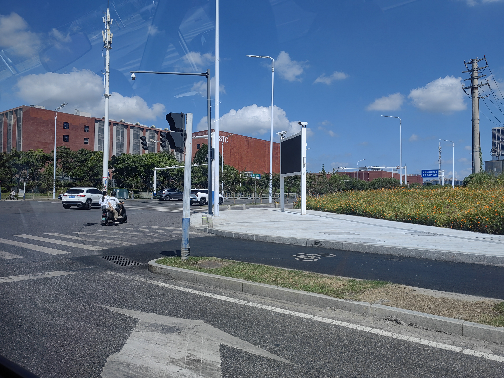
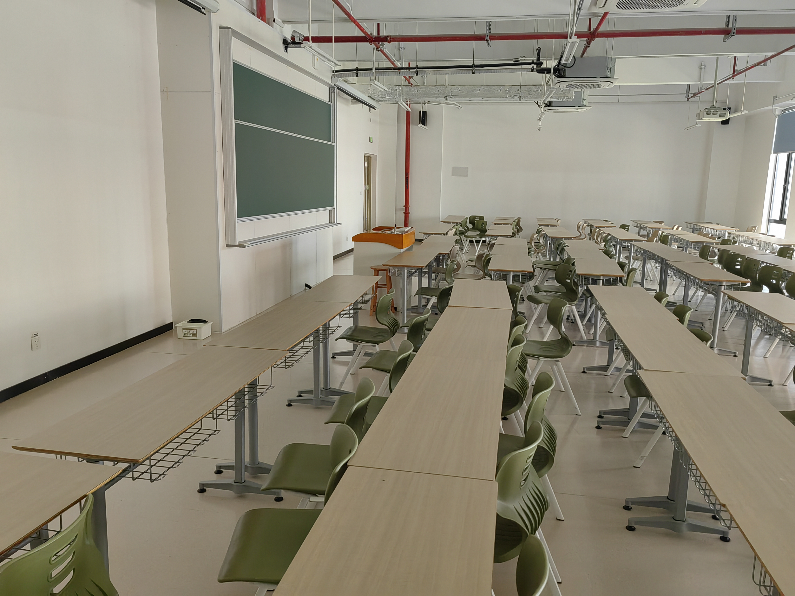
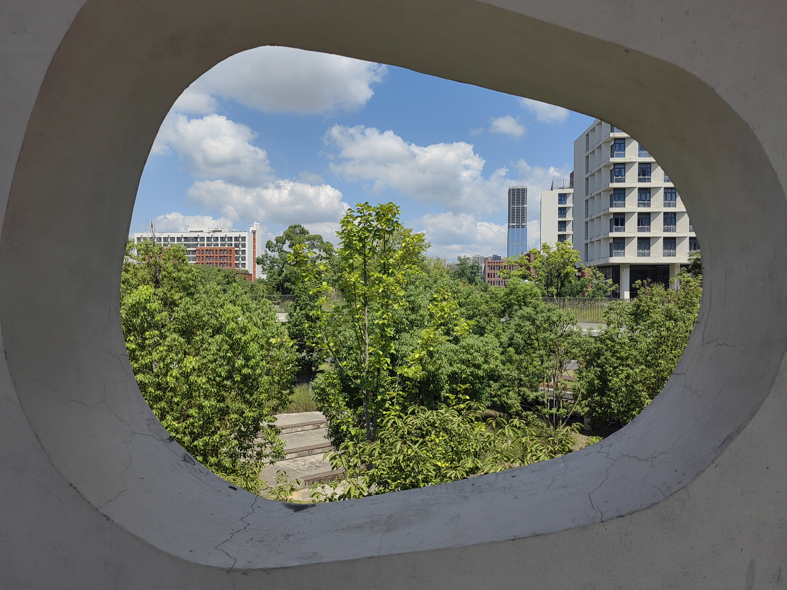
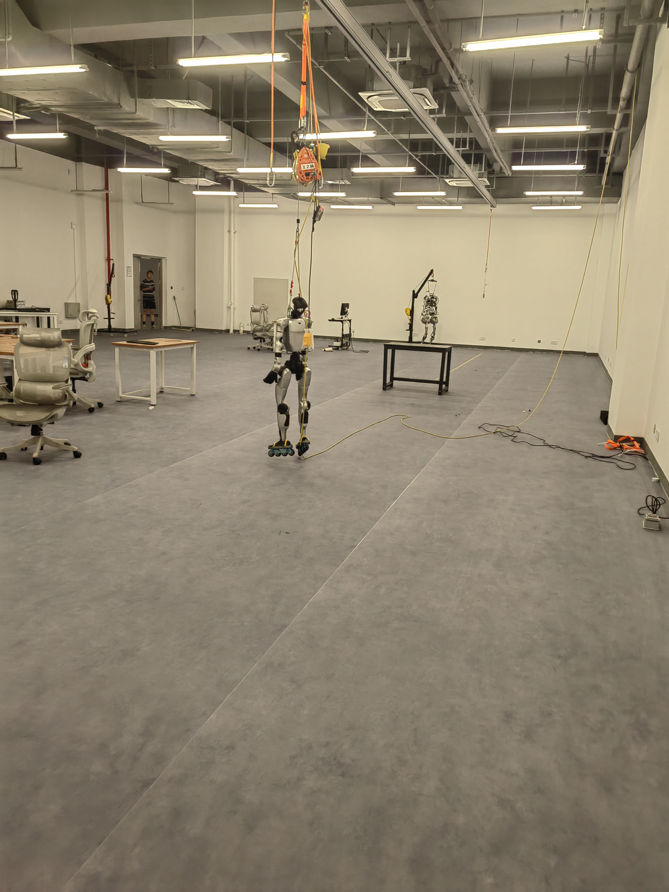

上午 10 点打车去科大高新校区，路上就看到楼上的 **USTC** 字样。

我们的从**西门**进入学校（还需要通过系统亲朋预约进校，直接刷校园卡还不行）。

学宇新买了一辆二手电动车，但是刚上坡带着我就骑不动了，于是我扫了一辆共享单车（美团的小黄车，用不了学校的哈喽单车骑行卡🥺）。

我们沿着路，经过先生活区，看到了方方正正的图书馆（不过要刷校园卡，所以没进去参观），有路过**智信学部**（还有好几个学院的牌子，应该是计算机、电子信息之类的，后面远辉告诉我这是网红打卡点）。与生活区紧挨着的是宿舍区。路上还路过了几个教学楼。

学宇把车停在食堂旁边，我们步行去 2 号教学楼和 3 号教学楼，期间路上路过一个亭子，我们在上面坐着歇了会儿。

我们从一侧开着的小门进入 2 号教学楼，里面跟合工宣之前的大学生活动中心一样（当然科大配置更好），上课的教室在 2 楼，我拍了张教室照片（PS: 这个教室很宽坐在边上估计要得斜视）。

从 2 号教学楼那个小门出来，正对着的就是 3 号教学楼，中间有个连接的桥，桥的墙上有个洞感觉还挺特别，像飞机的舷窗。

3 号教学楼进去是人形机器人实验室（占了 2 层整层和 1 层的部分），二楼，甚至还有公开办公区（可能是因为房间不够用了）。里面有关具身智能训练场，有机器人。看到了一楼有几个教室里面在上课，绕了一圈然后我们正好出去。

刚好到饭点了，随后我们就去食堂。先去看了看左边的**玉兔餐厅**，一楼是自选的套餐，二楼是一些公式各样的门面。之后我们穿过去，到右边的**科大餐饮**，分布还是比较类似的。

正好远辉也在学校，我们把他喊过来一起吃饭。我们到在右边的二楼吃。

吃的是蘸水菜（基础是 9 元的素菜，然后我加了牛肉和鸡肉双拼，加上米饭一共是 16.5 元），分量还挺大的，而且还比较新鲜，占了酱料味道还很不错。付款是扫到学宇的二维码（这个与校园卡不是同一支付系统管理的，大概是类似微信零钱那种吧）。

出完饭，我们先去银泰百货，学宇把车放在店里维修。随后，我们就去商场了。

> （未完待续）
