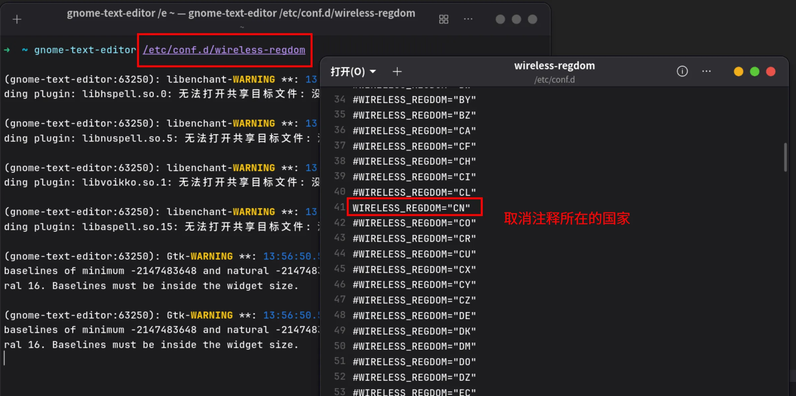
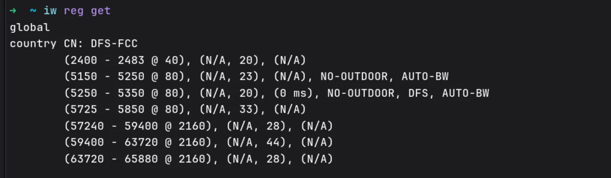
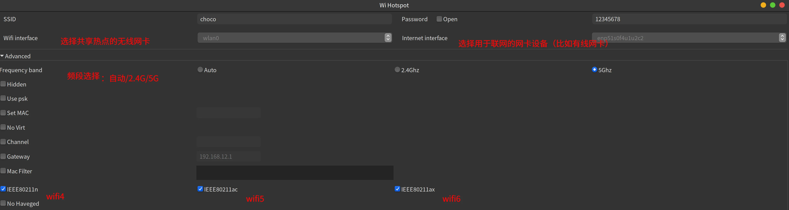

# 在 Linux 上创建 5GHz Wi-Fi 6 热点：从零开始的完整指南

你是否想过把你的 Linux 笔记本变成一个高速无线热点？默认情况下，大多数 Linux 桌面自带的网络工具只会在 **2.4GHz** 频段创建热点，最高网速仅约 144Mbps。但如果你的设备支持 **Wi-Fi 6（802.11ax）** 和 **5GHz 频段**，其实完全可以跑出更快的速度！

本文将手把手教你如何在 Linux 上配置并启用 **5GHz Wi-Fi 6 热点**，关键在于正确设置国家码（Regulatory Domain），否则系统会限制使用更高频段。

---

## 📌 前提条件

- 一台运行 Linux 的电脑
- 支持 5GHz 和 Wi-Fi 6 的无线网卡（可通过 `iw dev` 查看）
- 已安装 `linux-wifi-hotspot` 或类似工具
- 安装了 `iw` 工具用于查看无线信息

---

## ✅ 第一步：安装必要的工具

```bash
# 安装 iw 工具（用于查看无线规则）
sudo pacman -S iw

# 安装 wireless-regdb（管理国家码数据库）
sudo pacman -S wireless-regdb
```

> 如果你是 Ubuntu 用户，替换为：
> ```bash
> sudo apt install iw wireless-regdb
> ```

---

## ✅ 第二步：配置国家码（关键！）

Linux 系统为了遵守各国无线电法规，默认会限制可用频段。在中国，必须设置国家码为 `CN` 才能使用 5GHz 频段。

### 1. 编辑国家码配置文件

```bash
sudo vim /etc/conf.d/wireless-regdom
```

### 2. 找到并取消注释 `CN`

查找如下行：

```bash
#WIRELESS_REGDOM="CN"
```

将其改为：

```bash
WIRELESS_REGDOM="CN"
```

> 🔹 注意：确保只有一个国家码被启用，其余都保留注释。



---

## ✅ 第三步：重启电脑并验证

### 验证国家码是否生效

```bash
iw reg get
```

输出应包含：

```
country CN: DFS-FCC
(5150 - 5250 @ 80), ...
(5250 - 5350 @ 80), ...
...
```



✅ 国家码为 `CN`
✅ 看到 `5GHz` 频段（如 5150–5250 MHz），说明已成功启用！

---

## ✅ 第四步：创建 5GHz Wi-Fi 6 热点

现在你可以使用 `linux-wifi-hotspot` 创建热点了。

### 1. 启动 hotspot 软件

```bash
linux-wifi-hotspot
```

### 2. 选择以下参数：

- **SSID 名称**：自定义，比如 `MyWiFi6`
- **密码**：建议使用 WPA2 或 WPA3
- **频段选择**：选择 **5GHz**
- **协议选择**：选择 **Wi-Fi 6 (802.11ax)**



---

## ✅ 最后检查

连接手机或电脑测试：

- 是否显示 5GHz 信号？
- 是否有“Wi-Fi 6”标识？
- 速度是否明显提升（可达 300Mbps 以上）？


---

## 🧩 小贴士

| 问题 | 解决方法 |
|------|----------|
| 无法启用 5GHz | 检查国家码是否为 `CN` |
| 热点启动失败 | 确保网卡支持 AP 模式 |
| 速度慢 | 尝试更换信道（如 149、153、157） |

---

## 📚 参考资料

- [ArchWiki: Wireless Regulatory Domain](https://wiki.archlinux.org/title/Network_configuration/Wireless#Respecting_the_regulatory_domain)
- [ArchWiki: Software Access Point](https://wiki.archlinux.org/title/Software_access_point)

---
