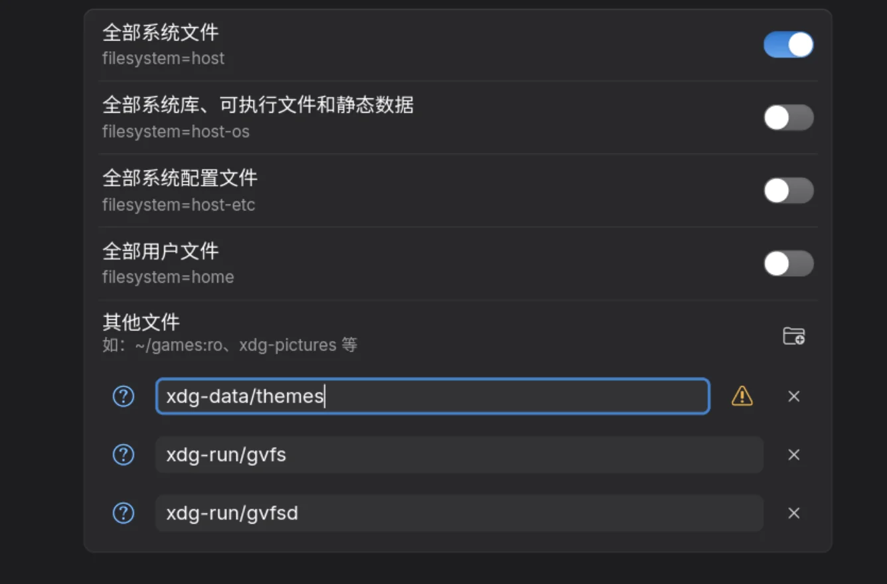

## Nautilus 弹窗按钮的“反复横跳”

### 现象

在使用 Nautilus（文件管理器）清空回收站时，弹出的警告窗口中，“取消”和“清空”两个按钮会在“单行并排”和“上下两行”之间疯狂切换，导致整个弹窗无限闪烁，甚至无法点击。但只要切换回原生 Adwaita 样式，问题就消失了。


### 原因：C 代码与 CSS 的的冲突

这是 GTK 的布局管理器（底层 C 代码）和外部主题 CSS 之间产生了的冲突：

1. **布局管理器**：它先测量了两个按钮的原生宽度，发现当前窗口宽度足够，于是下令：“空间充裕，单行显示！”
2. **CSS 渲染引擎**：正准备把单行画到屏幕上时，WhiteSur 主题的 CSS 介入了，强行给按钮和容器加上了自定义的 `padding` 和 `margin`。加上这些边距后，宽度瞬间溢出了窗口。渲染引擎报错：“放不下，换多行！”
3. **死循环开始**：系统被迫切成上下两行，宽度要求骤减，不再溢出。此时布局管理器又醒了，按原生宽度一算：“咦，明明能放下单行啊？切回单行！” 随后 CSS 再次加入边距导致溢出……一秒钟几十次的疯狂重绘就开始了。

### 解决方案

既然是自定义 CSS 画蛇添足，最彻底的办法就是直接删除相关的样式设置。
打开 `~/.config/gtk-4.0/gtk-Dark.css` (及 Light 版本)，搜索 `window.dialog.message`、`window.messagedialog` 或 `.response-area`，将主题自定义的边距代码全部删掉，或者强制覆盖掉：

```css
/* 移除导致 AdwMessageDialog 宽度计算错误的 padding，彻底解决布局死循环 */
window.messagedialog .response-area,
window.dialog.message .dialog-action-area {
    padding: 0 !important;
}

window.messagedialog .response-area button,
window.dialog.message .dialog-action-area button {
    margin: 0 !important;
}
```

保存并重启应用（`nautilus -q`），按钮就会按原生逻辑排列，不再闪烁了。

***

## Flatpak Handbrake 应用背景全透明

### 现象

安装了 Flatpak 版的 Handbrake（基于 GTK 4.20），打开后发现整个窗口背景是 100% 镂空的，直接透出了桌面壁纸，导致文字完全看不清。神奇的是，如果通过包管理器（如 `paru` / `pacman`）原生安装 Handbrake，背景却是正常的暗色半透明。然后将主题文件夹放在 ~/.themes 之后又有背景，放回 ~/.local/share/themes 之后有变成透明了


### 原因：沙盒隔离导致未读取到主题

### 解决方案

将主题路径添加到 HandBrake 的可访问权限。



## 总结

配置的代码地址：https://github.com/WangWindow/whitesur-gtk-4.0
