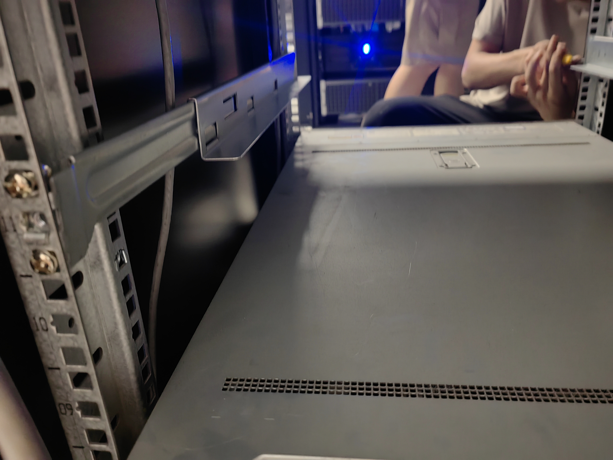
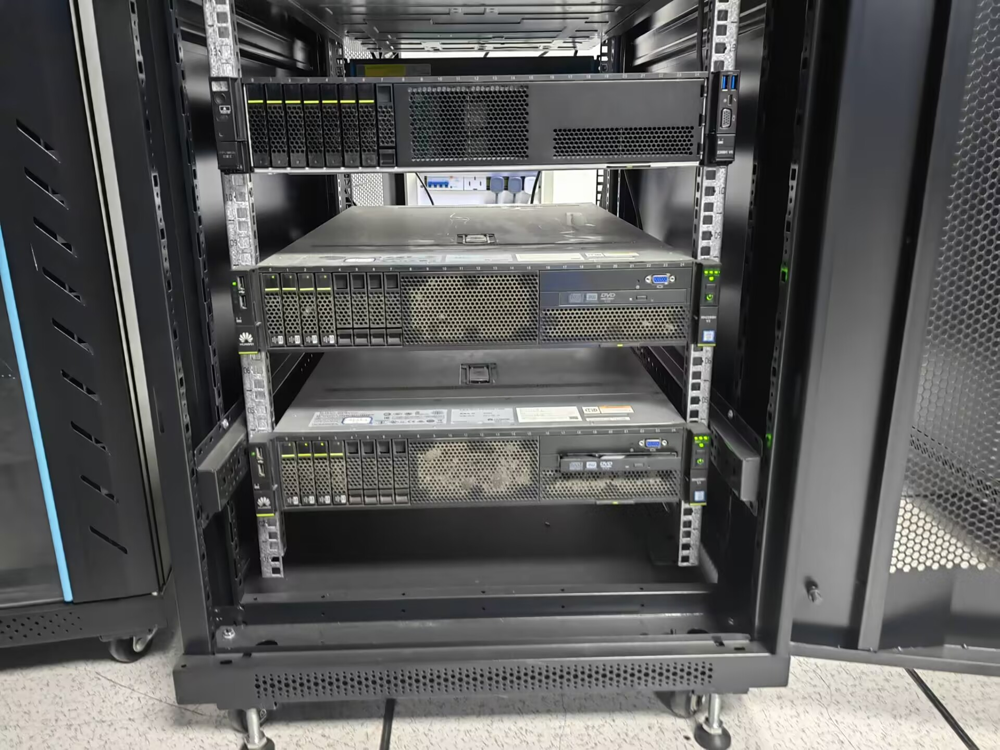
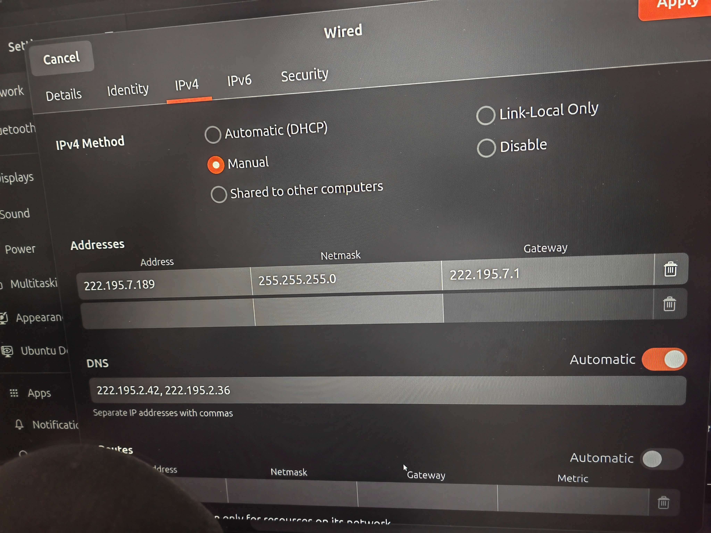
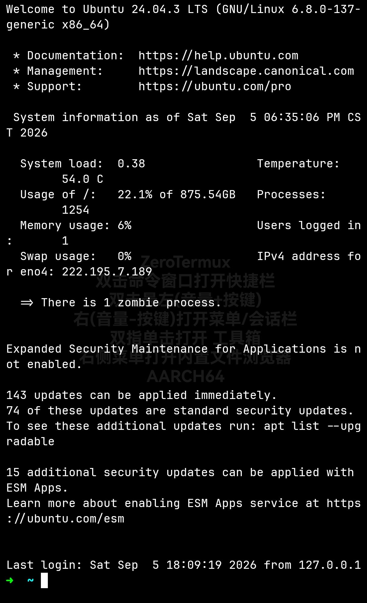

今天下午，我和几个同学把实验室的` 4 卡 4090 服务器`搬运到学校的`机房`进行托管。

我先从宿管阿姨那里使用`抵押证件`的方式获取到一个**小推车**，然后前往双子楼与_队友们_会合。

还没到机房门口，就听到“嗡嗡”的轰鸣声——里面已经有很多服务器在工作了。

我们把小车停在外面，先进去看看情况。

我一进门就发现三个问题：

1. 机房里面的线错综复杂，并且排插串联，存在明显的安全隐患；
2. 里面还有一些电脑主机（包括几台废弃的）占用了不小空间；
3. 有两个房间，但是另一个房间比较小，而且散热条件较差。

我们一开始准备找个托盘，找了一下周围，结果发现的是个盖子，而不是能插入机柜的托盘。

直接放在地上的话，如果空调或者其他原因出现漏水等问题，那么服务器就报废了。所以放在地上不安全。

于是我们就把服务器搬到桌子上，但是发现桌子不够宽，很容易掉落；如果把服务器横着放的话，又没法接线（被桌子两侧的挡板挡住了）。

还是要考虑放到柜子里面。

总之，经过好一段时间的折腾，我们突然发现服务器的支架（之前我还以为是用来把服务器垫高用的）可以很好的卡在机柜的支架上。

正好在另一个机器旁边找到了一些大小合适的螺丝，我们把支架安装好，然后把服务器搬上去，连接电源、网线，大功告成！？

什么竟然连不上网？

我们尝试了不同的校园网账号，均以失败告终（而之前放在实验室的时候，连接网线后就会提示校园网认证）。使用 `ip addr` 命令，发现根本没有**ipv4**地址。

经过在机房管理群中询问，我们得到了重要信息：网关、DNS，以及需要设置固定 ip 地址。在 gnome 设置中，通过图形界面很快完成了网络设置，这下终于能上网啦！

>（实际上，我们在网络问题上耗费了还不少时间，唉，还是**计网**没学好啊）

我先回去吃晚饭，然后同学告诉我服务器死机了。他们重启了一下，我用 termux 进行 ssh 远程连接，连接成功。

但是但是，晚上回实验室，服务器又连接不上了。尝试 ping 了同一网段的其他 ip 发现都能 ping 通，就是我们的那个服务器的 ping 不同，大概又死机了，这是怎么回事呢？

不过，我明天要出去玩，估计要到下周才能去探究。
