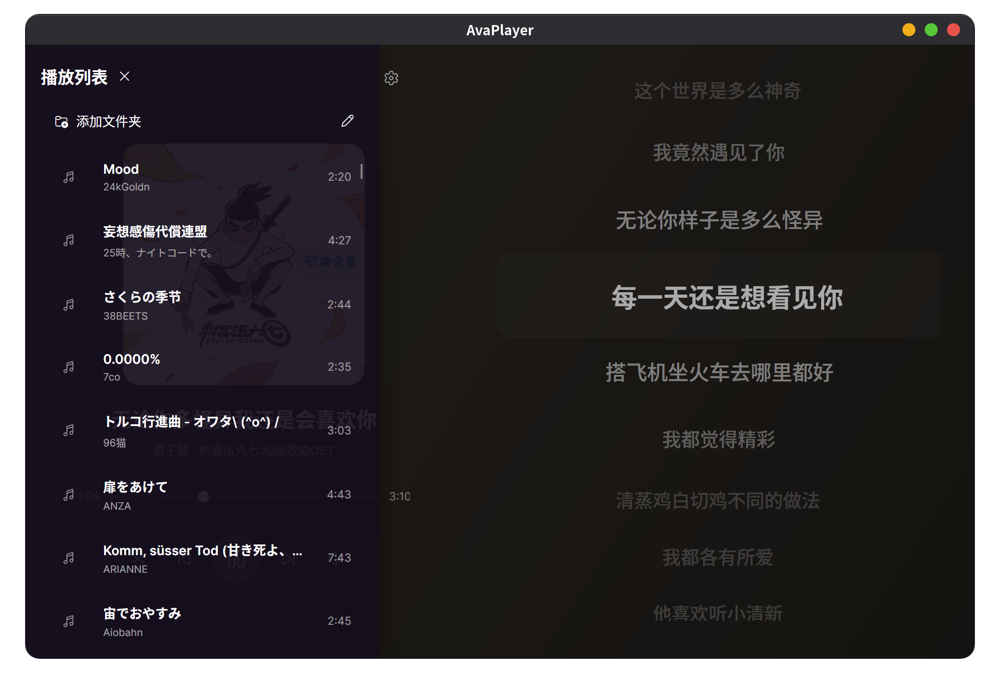

4月几号的时候 Avalonia 团队发布了新的 v12 版本，大幅提高性能，并且正好也更新了 VSCode 插件，所以准备练练手。正巧前段时间沉迷于本地音乐播放器（使用的是 Amberol）。

使用到依赖注入、AOT发布等技术。

实现与系统播放控件的联动。

支持从一些公益网站上抓取歌曲封面和歌词（如果联网了的话）。

项目详见 Github：<https://github.com/WangWindow/AvaPlayer>

README：<https://github.com/WangWindow/AvaPlayer/blob/main/README.md>
