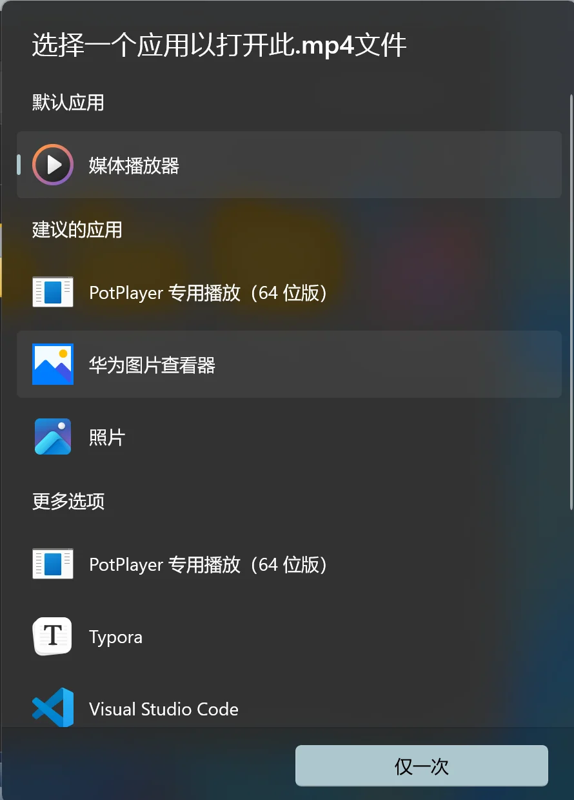
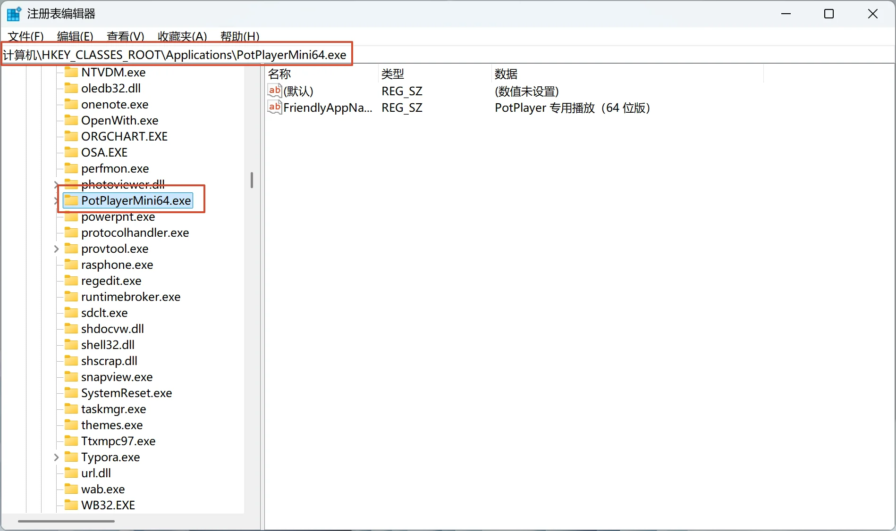

Windows 的注册表是个 “好东西”，使用 **Geek Uninstaller** 卸载完软件之后，如果应用修改过文件启动方式，那么就会出现这样的 “幽灵” 条目：



可以在注册表这里

```plain
计算机\HKEY_CLASSES_ROOT\Applications
```

删除对应软件条目即可解决



然后在看一下打开方式，potplayer 的已经被清除了


参考链接：

[https://www.zhihu.com/question/515691937](https://www.zhihu.com/question/515691937)
