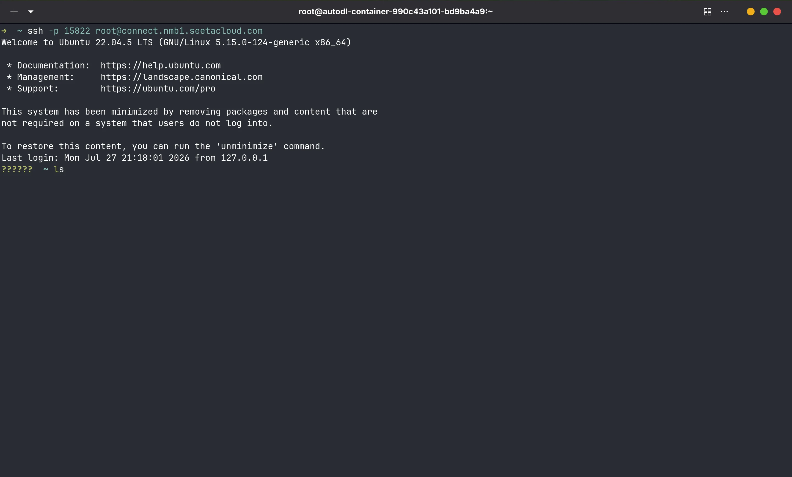
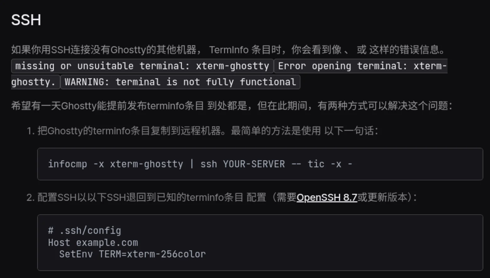

# 前言

之前一直用的是 Ptyxis，这个 Gnome 的默认终端。但是最近远程连接服务器发现经常出现无法复制或者粘贴远程的内容。上网搜索发现原来是需要支持 `OSC52` .

> **OSC52 是一种终端转义序列协议，用于将文本从远程终端复制到本地系统剪贴板。**

于是寻找支持这一特性的终端模拟器。

# DeepSeek 一下

首先，Ptyxis、Gnome Console 这类基于 VTE (Visual Terminal Emulator)的是明确不支持 OSC52，主要是出于安全考虑，详见 [Add support for OSC 52](https://gitlab.gnome.org/GNOME/vte/-/work_items/2495) 中的讨论。

于是用 AI 推荐其他的，主要有以下几个候选：

1. Alacritty 
2. Kitty
3. Ghostty
4. Wezterm

其中，我安装了前 3 个（Wezterm 没装）。发现只有 Ghostty 支持 GTK 主题（由于我使用的是 Gnome 桌面，如果不支持 GTK 主题会很困扰的🥺）。而且 Ghostty 还支持 GPU 加速，应该可以看作是 Ptyxis 的 “升级版”。

这下远程使用 nvim 和 ms-edit 就方便多了。

# 问题

然而，刚进行 ssh 连接就出现问题了：

终端的字符显示混乱，并且输入也出现很乱。查阅资料得知，通常不同的终端模拟器都有自己的 terminfo，比如 ghostty-terminfo，而这个在一些比较旧的系统上就无法被识别。从而导致出现奇怪的问题。

> **💡什么是 terminfo 数据库？**
>
> UNIX 系统上的 terminfo 数据库用于定义终端和打印机的属性及功能，包括各设备（例如，终端和打印机）的行数和列数以及要发送至该设备的文本的属性。

[Ghistty Help | Terminfo](https://ghostty.org/docs/help/terminfo) 给出了 2 个临时的方法解决这个问题。

不过我用第一个方法失败了。第二种方法其实就是连接前设置一下 `TERM` 环境变量，以便识别到是什么终端，通常 xterm 的格式是通用的，所以这里使用 xterm-256color。

很不错呢👻
