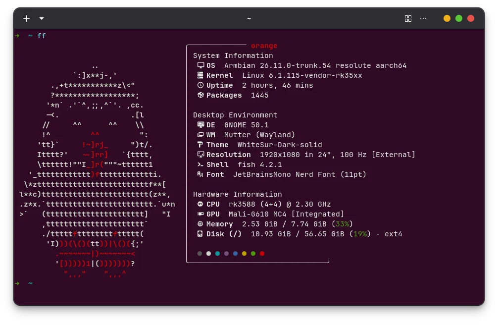

之前桌面一直在用 Ghostty，在普通的 x86 Linux 上基本没有遇到什么图形相关的问题。最近把 Orange Pi 5B 也装上 GNOME 当作一台小桌面使用，顺手安装 Ghostty，结果刚打开就翻车了🥲。

最后发现问题不在 Ghostty 本身，而是 **RK3588 的 Mali-G610 在当前 Mesa/Panfrost 下只能提供 Desktop OpenGL 3.1，而新版 Ghostty 需要 OpenGL 4.3**。

这里简单记录一下安装、排查过程以及我最后使用的解决方法。

## 使用环境

| 项目 | 环境 |
| --- | --- |
| 开发板 | Orange Pi 5B |
| SoC | Rockchip RK3588S |
| 系统 | Armbian / Ubuntu 26.04 Resolute |
| 内核 | `6.1.115-vendor-rk35xx` |
| 桌面 | GNOME / Wayland |
| GPU | Mali-G610 MC4 |
| GPU Kernel Driver | Panthor |
| Mesa | 26.0.8 |
| Ghostty | 1.3.0-dev |

这里使用 vendor 6.1 内核主要是因为还需要使用 RK3588 的 RKNPU。GPU 则通过 Armbian 自带的 `panthor-gpu` overlay 使用 Panthor。



<details>
<summary> 启用 Mali-G610 硬件加速 </summary>

vendor 6.1 默认可能仍然使用 ARM 的 `mali_kbase` 驱动，这种情况下 Mesa 会退回 `llvmpipe` 软件渲染。

先确认系统中是否已经带有 Panthor：

```bash
modinfo panthor
```

以及对应的 Device Tree Overlay：

```bash
find /boot/dtb-$(uname -r) \
    -type f \
    -iname '*panthor*'
```

我这里可以找到：

```text
rockchip-rk3588-panthor-gpu.dtbo
```

因此在 `/boot/armbianEnv.txt` 中加入：

```text
overlays=panthor-gpu
```

> 如果原本已经有 `overlays=`，不要再写第二行，直接把 `panthor-gpu` 追加到原来的列表中。

然后重启：

```bash
sudo reboot
```

检查：

```bash
glxinfo -B
```

正常情况下可以看到：

```text
Accelerated: yes
OpenGL renderer string: Mali-G610 MC4 (Panfrost)
OpenGL core profile version string: 3.1 Mesa 26.0.8
```

这说明 Panthor + Panfrost 已经正常工作。

<details>
<summary>补充：确认 PanVK / Vulkan 是否正常</summary>

可以运行：

```bash
vulkaninfo --summary
```

我的 Orange Pi 5B 上输出为：

```text
deviceName = Mali-G610 MC4
driverName = panvk
apiVersion = 1.4.x
```

DRM render node 也可以确认：

```bash
for x in /sys/class/drm/renderD*/device/driver; do
    echo "$x -> $(readlink -f "$x")"
done
```

我的系统中分别是：

```text
renderD128 -> rockchip-drm
renderD129 -> RKNPU
renderD130 -> panthor
```

这里 `rockchip-drm` 是显示控制器，`RKNPU` 是 NPU，而真正的 Mali-G610 是 `panthor`。

</details>

</details>

## Ghostty 启动异常

GPU 硬件加速已经正常了，但是打开 Ghostty 后还是会提示：

```text
Unable to acquire an OpenGL context for rendering.
```

一开始还以为 Panthor 配置有问题，但是：

```bash
glxinfo -B
```

明明显示：

```text
Accelerated: yes
OpenGL renderer string: Mali-G610 MC4 (Panfrost)
```

后来才发现真正的问题是 OpenGL **版本**。

Ghostty 从 1.2 开始，在 Linux GTK 版本中最低要求 Desktop OpenGL 4.3，而当前 Mali-G610 的 Mesa Panfrost 只能提供 OpenGL 3.1。

所以现在的情况其实是：

```text
Mali-G610
    ↓
Panthor
    ↓
Panfrost
    ↓
OpenGL 3.1
    ↓
Ghostty 要求 OpenGL 4.3
    ↓
启动失败
```

GPU 没坏，驱动也没坏，只是目前提供的 Desktop OpenGL 版本不够。

<details>
<summary>尝试使用 Zink</summary>

由于 PanVK 已经可以提供 Vulkan 1.4，所以我又尝试使用 Zink：

```text
Ghostty
    ↓ OpenGL
Zink
    ↓ Vulkan
PanVK
    ↓
Panthor
    ↓
Mali-G610
```

理论上这样可以通过 Vulkan 实现更高版本的 OpenGL。

强制指定 PanVK：

```bash
VK_DRIVER_FILES=/usr/share/vulkan/icd.d/panfrost_icd.json \
MESA_VK_DEVICE_SELECT=13b5:a8670005! \
MESA_LOADER_DRIVER_OVERRIDE=zink \
glxinfo -B
```

确实成功选到了 Mali-G610：

```text
Device: zink Vulkan 1.4(Mali-G610 MC4 (MESA_PANVK))
Accelerated: yes
```

但是同时会出现：

```text
doesn't support base Zink requirements:
feats.features.shaderClipDistance
```

最终 Zink 只能提供：

```text
OpenGL version string: 2.1
```

所以当前 Mesa 26.0.8 下还是不能用 Ghostty。

<details>
<summary>补充：以后 Mesa 更新后可能可以直接使用 Zink</summary>

Mesa 26.1 中已经加入了：

```text
zink: emulate clip distance
```

同时还有一些针对 PanVK + Zink 的修改。

所以以后系统 Mesa 更新到 26.1 或更高版本后，可以重新测试：

```bash
VK_DRIVER_FILES=/usr/share/vulkan/icd.d/panfrost_icd.json \
MESA_VK_DEVICE_SELECT=13b5:a8670005! \
MESA_LOADER_DRIVER_OVERRIDE=zink \
glxinfo -B
```

如果能够提供：

```text
OpenGL core profile version string: 4.3
```

或者更高，那么 Ghostty 就有机会直接通过：

```text
Ghostty → Zink → PanVK → Panthor → Mali-G610
```

进行 GPU 加速。

不过这只是解决了当前遇到的 `shaderClipDistance` 阻塞，不代表升级 Mesa 后一定可以直接达到 OpenGL 4.3，还是需要实际测试。

</details>
</details>

## 解决方法：让 Ghostty 使用 llvmpipe

Mesa 自带的软件渲染器 llvmpipe 能够提供 OpenGL 4.5：

```bash
LIBGL_ALWAYS_SOFTWARE=1 ghostty
```

这样 Ghostty 就可以正常启动了。目前来看这是最简单、最稳定的方法。

## 包装一个脚本替代原本的 Ghostty

因为我的 `/usr/bin/ghostty` 是 dpkg 管理的，如果直接把 `/usr/bin/ghostty` 改成脚本，下次软件包更新时又会被覆盖。

这里可以使用 `dpkg-divert`。

首先把软件包原来的 Ghostty 重定向到：

```text
/usr/bin/ghostty.real
```

执行：

```bash
sudo dpkg-divert \
    --add \
    --rename \
    --divert /usr/bin/ghostty.real \
    /usr/bin/ghostty
```

然后创建新的 `/usr/bin/ghostty`：

```bash
printf '%s\n' \
    '#!/bin/sh' \
    'exec env LIBGL_ALWAYS_SOFTWARE=1 /usr/bin/ghostty.real "$@"' \
    | sudo tee /usr/bin/ghostty >/dev/null

sudo chmod +x /usr/bin/ghostty
```

现在：

```bash
ghostty
```

实际上执行的是：

```text
/usr/bin/ghostty
    ↓ wrapper
LIBGL_ALWAYS_SOFTWARE=1
    ↓
/usr/bin/ghostty.real
```

这样从 GNOME 菜单启动 Ghostty 也不需要额外设置环境变量。

而且以后通过 APT 更新 Ghostty 时，dpkg 会知道 `/usr/bin/ghostty` 已经被 divert，新的二进制仍然更新到 `/usr/bin/ghostty.real`，不会直接覆盖 wrapper。

查看 diversion：

```bash
dpkg-divert --list /usr/bin/ghostty
```

<details>
<summary>如何恢复原来的 Ghostty？</summary>

先删除 wrapper：

```bash
sudo rm /usr/bin/ghostty
```

然后取消 diversion：

```bash
sudo dpkg-divert \
    --remove \
    --rename \
    --divert /usr/bin/ghostty.real \
    /usr/bin/ghostty
```

这样 `/usr/bin/ghostty.real` 就会恢复成正常的 `/usr/bin/ghostty`。

</details>

## 总结

一开始看到 Ghostty 无法创建 OpenGL Context，还以为是 Orange Pi 5B 的 GPU 驱动有问题。

实际上 Panthor、Panfrost 和 PanVK 都工作正常：

```text
Mali-G610
├── Panfrost → OpenGL 3.1
└── PanVK    → Vulkan 1.4
```

真正的问题只是 Ghostty 1.2+ 要求 OpenGL 4.3，而当前 RK3588 上的 Panfrost 达不到这一要求。

Zink 目前又受 PanVK `shaderClipDistance` 能力限制，因此最终先让 Ghostty 单独使用 llvmpipe：

```bash
LIBGL_ALWAYS_SOFTWARE=1 ghostty
```

再通过 `dpkg-divert + wrapper` 把这个 workaround 固定下来。

等后续 Mesa / Zink 对 PanVK 的支持进一步完善之后，再尝试切回 GPU 渲染就可以了👻。

## 参考

1. Ghostty Documentation — Binaries and Packages  
   https://ghostty.org/docs/install/binary
2. Ghostty 1.2.0 Release Notes — OpenGL 4.3 requirement  

   https://ghostty.org/docs/install/release-notes/1-2-0

3. Ghostty Discussion #6073 — Software rendering fallback  
   https://github.com/ghostty-org/ghostty/discussions/6073
4. Ghostty Discussion #13907 — Raspberry Pi 5 / GLES / Vulkan renderer  

   https://github.com/ghostty-org/ghostty/discussions/13907

5. Mesa Documentation — Panfrost / PanVK  
   https://docs.mesa3d.org/drivers/panfrost.html
6. Mesa 26.1 Release Notes — `zink: emulate clip distance`  

   https://docs.mesa3d.org/relnotes/26.1.0.html

7. Armbian — Orange Pi 5B board configuration  
   https://github.com/armbian/build/blob/main/config/boards/orangepi5b.csc
